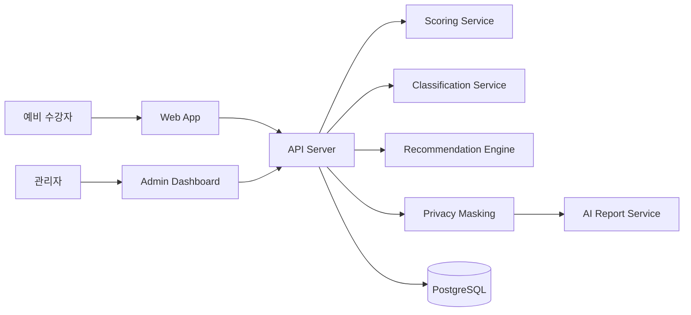
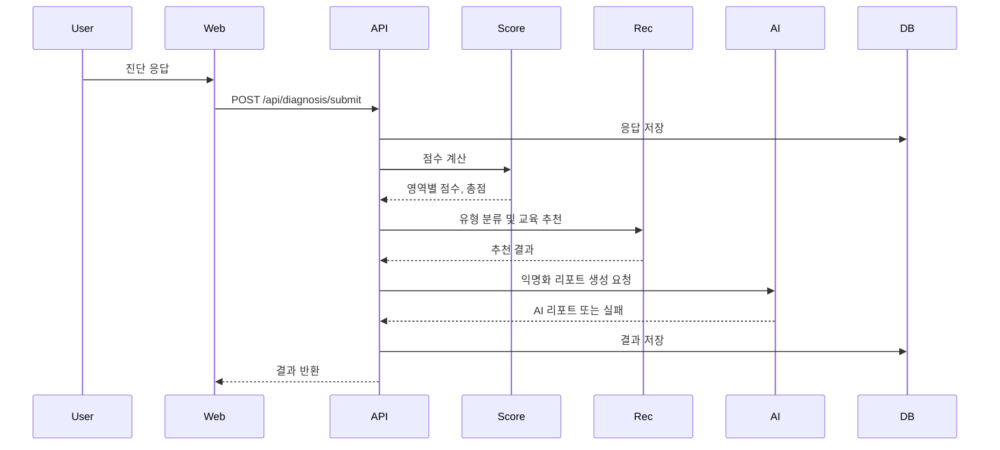

# Architecture

## 전체 시스템 구조

## 권장 기술 스택
| 영역 | 권장 |
|---|---|
| Frontend | Next.js 또는 React |
| UI | Tailwind CSS, shadcn/ui 또는 자체 컴포넌트 |
| Backend | Next.js API Routes 또는 FastAPI |
| DB | PostgreSQL 또는 Supabase |
| ORM | Prisma 또는 SQLAlchemy |
| AI | OpenAI-compatible LLM API |
| Chart | Recharts 또는 Chart.js |
| Test | Vitest/Jest, Playwright |

## 데이터 흐름

## 핵심 설계 원칙
- 추천 결정은 규칙 기반 엔진이 수행한다.
- AI는 리포트 문장화에만 사용한다.
- AI 실패 시 전체 결과가 실패하면 안 된다.
- 교육 과정과 진단 문항은 seed/config 데이터로 관리한다.
