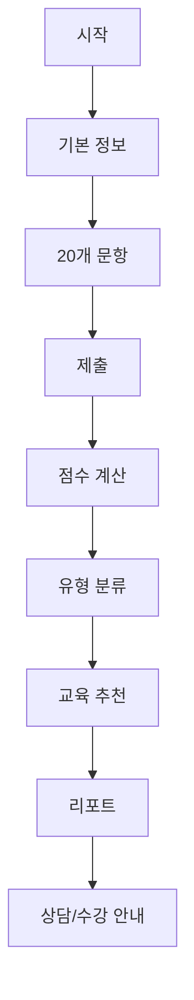

# UI/UX

## 화면 목록
| 화면 ID | 화면명 | 목적 |
|---|---|---|
| S-001 | 시작 화면 | 진단 목적, 개인정보 안내, 예상 시간 표시 |
| S-002 | 기본 정보 입력 | 직무, 관심 분야, 교육 목적 수집 |
| S-003 | 진단 질문 | 20개 문항 응답 |
| S-004 | 제출 확인 | 누락 확인 및 제출 |
| S-005 | 결과 요약 | 총점, 유형, 적합도 표시 |
| S-006 | 추천 교육 | 1~3순위 추천 과정 표시 |
| S-007 | 상세 리포트 | 강점, 보완점, 준비사항, 상담 메시지 |
| S-008 | 관리자 로그인 | 관리자 접근 제어 |
| S-009 | 관리자 대시보드 | 유형별 통계, 추천 TOP |
| S-010 | 응답자 목록 | 진단 결과 목록 조회 |
| S-011 | 응답 상세 | 개별 리포트 확인 |
| S-012 | 교육 과정 관리 | 과정 데이터 수정 |

## 사용자 흐름

## 상태값
| 상태 | 처리 |
|---|---|
| Empty | 데이터 없음 안내 |
| Loading | Skeleton/Spinner 표시 |
| Error | 오류 원인과 재시도 버튼 |
| AI Pending | 기본 결과 먼저 표시 |
| AI Failed | 기본 리포트 사용 안내 |

## 접근성
- 모든 입력에 label을 제공한다.
- 색상만으로 점수를 구분하지 않는다.
- 결과 그래프에는 텍스트 설명을 함께 제공한다.
- 모바일 기본 본문은 16px 이상으로 한다.
