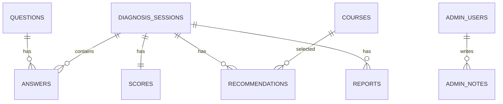

# DB 설계서

## ERD

## 주요 테이블
| 테이블 | 설명 |
|---|---|
| questions | 진단 문항 |
| courses | 교육 과정 |
| diagnosis_sessions | 진단 세션 |
| answers | 문항별 응답 |
| scores | 영역별 점수 |
| recommendations | 추천 과정 |
| reports | 리포트 |
| admin_users | 관리자 |
| admin_notes | 상담 메모 |

## courses 주요 컬럼
| 컬럼 | 설명 |
|---|---|
| course_id | CX-B-01 형식의 과정 코드 |
| category | 과정 카테고리 |
| title | 교육명 |
| course_type | 이론/실습/AI툴 |
| target | 주 대상 |
| suggested_level | 운영 난이도 |
| recommended_for | 추천 대상 |
| not_recommended_for | 비추천 대상 |
| is_representative | 대표 상품 여부 |

## diagnosis_sessions 주요 컬럼
| 컬럼 | 설명 |
|---|---|
| id | 세션 ID |
| job_role | 직무/관심 분야 |
| interest_areas | 관심 분야 배열 |
| learning_purpose | 교육 목적 |
| desired_output | 원하는 결과물 |
| status | started/submitted/completed |
| created_at | 생성일 |
| completed_at | 완료일 |

## 초기 진단 문항
| 번호 | 영역 | 질문 | 유형 |
|---|---|---|---|
| 1 | AI 이해도 | 생성형 AI에 대해 어느 정도 알고 있습니까? | single_choice |
| 2 | AI 이해도 | 사용해 본 AI 도구를 모두 선택해 주세요. | multi_choice |
| 3 | AI 이해도 | AI를 단순 검색이 아니라 업무 생산성 도구로 이해하고 있다. | scale_5 |
| 4 | AI 이해도 | AI 결과물을 검토하고 수정할 필요성을 알고 있다. | scale_5 |
| 5 | 디지털 활용 역량 | 문서 작성 도구를 어느 정도 사용할 수 있습니까? | single_choice |
| 6 | 디지털 활용 역량 | 엑셀·스프레드시트 활용 수준은 어느 정도입니까? | single_choice |
| 7 | 디지털 활용 역량 | 새로운 디지털 도구를 배우는 데 거부감이 적다. | scale_5 |
| 8 | 업무 적용 역량 | 현재 업무에서 AI를 적용하고 싶은 영역은 무엇입니까? | branch_choice |
| 9 | 업무 적용 역량 | 반복 업무를 줄이고 싶은 필요가 크다. | scale_5 |
| 10 | 업무 적용 역량 | 교육 후 만들고 싶은 결과물이 있습니까? | single_choice |
| 11 | 업무 적용 역량 | 현재 업무에서 가장 불편하거나 시간이 많이 드는 일을 적어 주세요. | free_text |
| 12 | 업무 적용 역량 | 본인의 직무 또는 관심 분야는 무엇입니까? | branch_choice |
| 13 | 기획 및 문제정의 역량 | 목표, 대상, 문제, 결과물을 구분해서 설명할 수 있다. | scale_5 |
| 14 | 기획 및 문제정의 역량 | 막연한 아이디어를 요구사항이나 실행 과제로 정리할 수 있다. | scale_5 |
| 15 | 기획 및 문제정의 역량 | AI에게 시키고 싶은 일을 한 문장으로 작성해 주세요. | free_text |
| 16 | 기획 및 문제정의 역량 | 가장 배우고 싶은 방향은 무엇입니까? | branch_choice |
| 17 | 학습 의지 및 실행력 | 교육 후 스스로 반복 실습할 의지가 있다. | scale_5 |
| 18 | 학습 의지 및 실행력 | 교육에서 원하는 방식은 무엇입니까? | single_choice |
| 19 | 학습 의지 및 실행력 | 교육 참여 목적은 무엇입니까? | branch_choice |
| 20 | 학습 의지 및 실행력 | 피드백을 받고 결과물을 개선할 의향이 있다. | scale_5 |

## 인덱스
- diagnosis_sessions.created_at
- scores.learner_type
- recommendations.course_id
- answers.session_id
- courses.course_id
