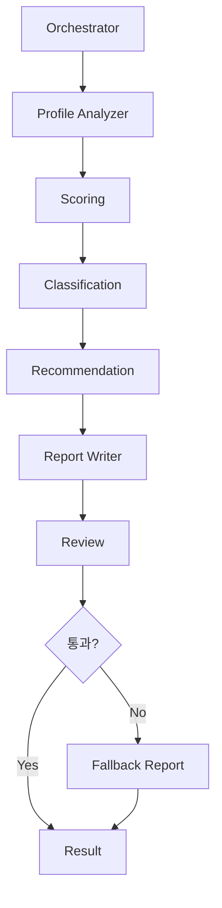

# Agent 설계서

## Agent 목록
| Agent | 역할 | 구현 방식 |
|---|---|---|
| Orchestrator Agent | 전체 진단 흐름 제어 | 서버 service |
| Profile Analyzer Agent | 프로필/자유서술 요약 | rule + optional AI |
| Scoring Agent | 점수 계산 | rule |
| Classification Agent | 유형 분류 | rule |
| Recommendation Agent | 교육 추천 | rule |
| Report Writer Agent | 리포트 문장화 | AI |
| Review Agent | AI 출력 검증 | rule |
| QA Agent | 최종 누락 검수 | checklist |

## Workflow

## 실패 처리
- 점수 계산 실패: 사용자 입력 오류 반환
- 추천 실패: 상담 권장 fallback
- AI 실패: 기본 템플릿 리포트 사용
- 검증 실패: AI 결과 폐기 후 fallback
