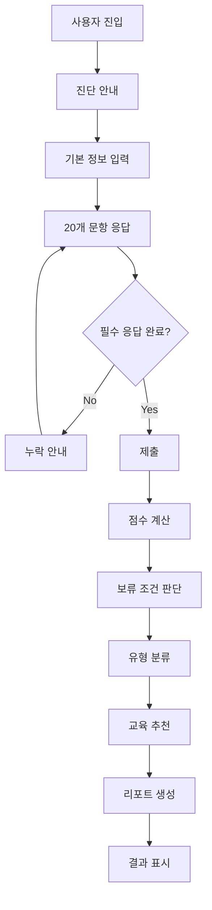
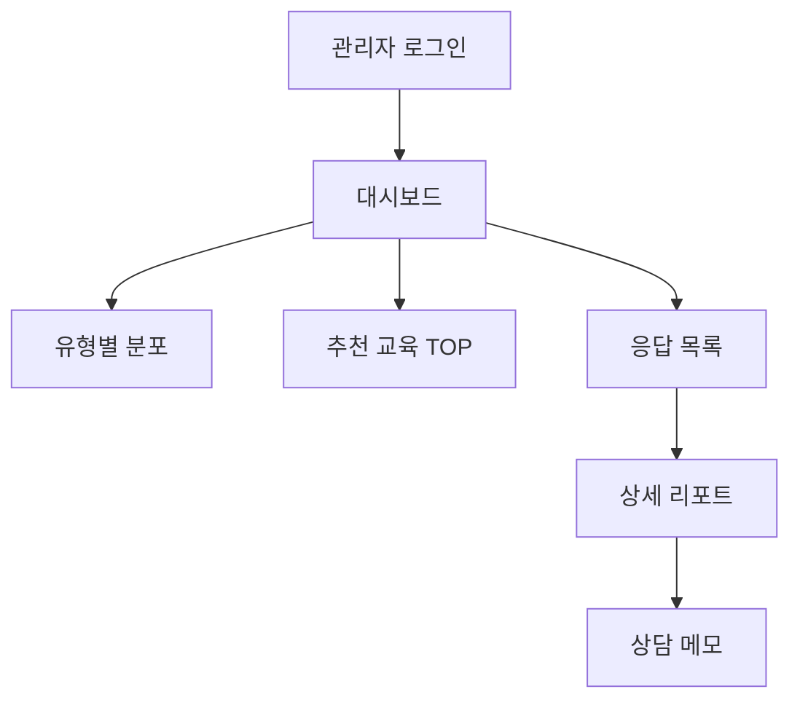
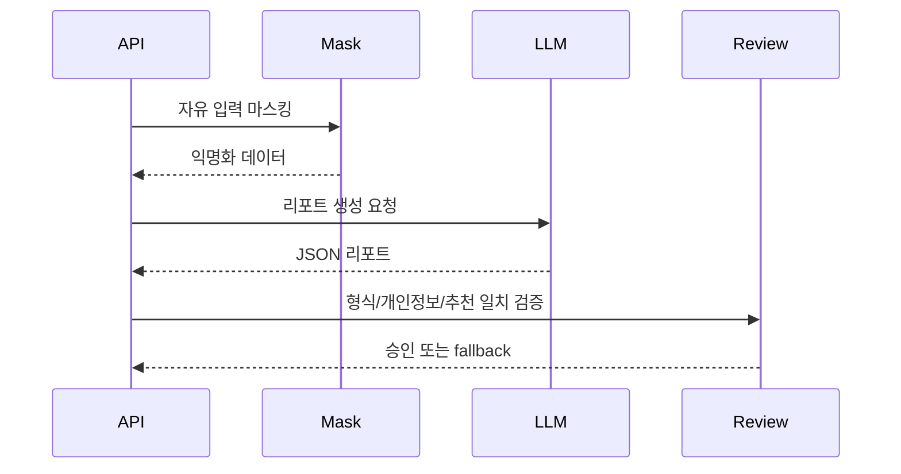

# Workflow

## 진단 흐름

```mermaid
flowchart TD
    A[사용자 진입] --> B[진단 안내]
    B --> C[기본 정보 입력]
    C --> D[20개 문항 응답]
    D --> E{필수 응답 완료?}
    E -->|No| F[누락 안내]
    F --> D
    E -->|Yes| G[제출]
    G --> H[점수 계산]
    H --> I[보류 조건 판단]
    I --> J[유형 분류]
    J --> K[교육 추천]
    K --> L[리포트 생성]
    L --> M[결과 표시]
```

## 관리자 흐름

```mermaid
flowchart TD
    A[관리자 로그인] --> B[대시보드]
    B --> C[유형별 분포]
    B --> D[추천 교육 TOP]
    B --> E[응답 목록]
    E --> F[상세 리포트]
    F --> G[상담 메모]
```

## AI 리포트 흐름

```mermaid
sequenceDiagram
    participant API
    participant Mask
    participant LLM
    participant Review
    API->>Mask: 자유 입력 마스킹
    Mask-->>API: 익명화 데이터
    API->>LLM: 리포트 생성 요청
    LLM-->>API: JSON 리포트
    API->>Review: 형식/개인정보/추천 일치 검증
    Review-->>API: 승인 또는 fallback
```
