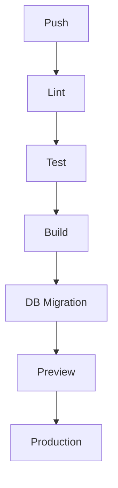

# Deploy

무료 플랜으로 시작하려면 [무료 배포 구성 가이드](./21_Free_Deployment_Guide.md)를 우선 참고한다.

## 환경
| 환경 | 목적 |
|---|---|
| local | 개발 |
| preview | 기능 검토 |
| staging | 배포 전 검증 |
| production | 운영 |

## 환경변수
```env
DATABASE_URL=
ADMIN_PASSWORD=
ADMIN_AUTH_SECRET=
LLM_API_KEY=
LLM_BASE_URL=
LLM_MODEL=
APP_BASE_URL=
AI_REPORT_ENABLED=true
PUBLIC_DIAGNOSIS_ENABLED=true
ADMIN_EDIT_ENABLED=false
```

- `ADMIN_PASSWORD`와 `ADMIN_AUTH_SECRET`은 운영 배포 전 강한 값으로 교체한다.
- `DATABASE_URL`은 운영 환경에서 관리형 PostgreSQL 등 영속 DB 사용을 권장한다.
- `LLM_API_KEY`를 비워두면 규칙 기반 리포트로 fallback한다.
- `ADMIN_EDIT_ENABLED`는 운영에서 과정 편집을 막으려면 `false`로 둔다.

## 배포 흐름


## 배포 전 체크리스트
- [ ] 빌드 성공
- [ ] 테스트 통과
- [ ] DB 스키마 적용 또는 migration 적용
- [ ] seed 적용
- [ ] 환경변수 등록
- [ ] AI fallback 확인
- [ ] 관리자 로그인 확인
- [ ] 개인정보 마스킹 확인
- [ ] 상담 신청 개인정보 고지 확인
- [ ] 공개 상담 API 스팸 방지 정책 확인
- [ ] 운영 도메인의 `APP_BASE_URL`, OG URL, 메타데이터 확인

## 롤백
- 배포 오류: 이전 deployment로 rollback
- DB 오류: migration rollback
- AI 장애: AI_REPORT_ENABLED=false 전환
