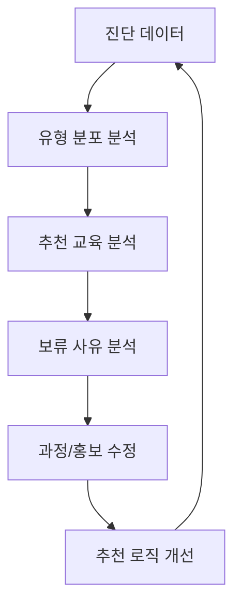

# Operation

## 운영 지표
| 지표 | 활용 |
|---|---|
| 진단 시작 수 | 홍보 유입 확인 |
| 진단 완료율 | UX 개선 |
| 유형별 분포 | 교육 구성 조정 |
| 추천 교육 TOP 5 | 상품화 우선순위 |
| 보류형 비율 | 기초 콘텐츠 필요성 |
| AI 실패율 | 안정성 점검 |
| 상담 전환율 | 비즈니스 성과 |

## 관리자 운영 프로세스
1. 매주 진단 완료 수와 유형 분포를 확인한다.
2. 추천 교육 TOP 5를 확인한다.
3. 보류형 사유를 검토한다.
4. 상담이 필요한 응답자를 확인한다.
5. 실제 수강 결과와 추천 결과를 비교한다.
6. 추천 로직 개선 사항을 기록한다.

## 개선 루프

