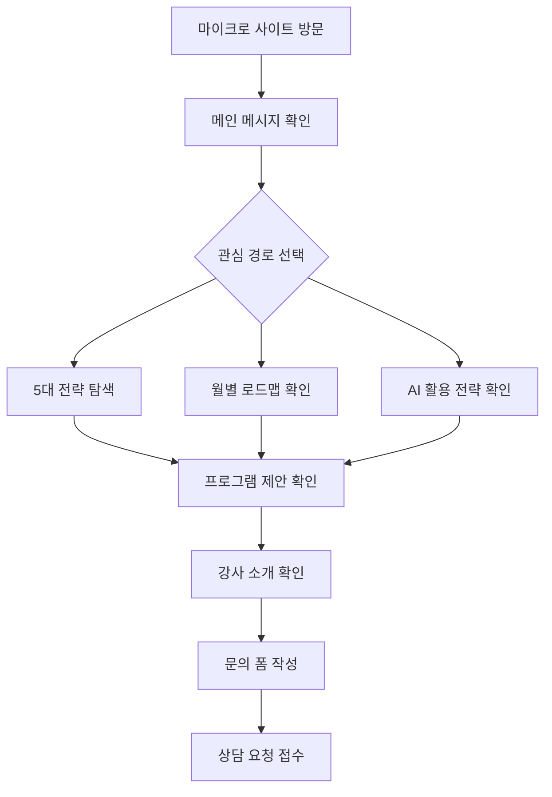

# 하반기 마케팅 캠페인 마이크로 사이트 웹서비스 정의서

## 서비스 한 줄 요약
2026년 하반기 마케팅 캠페인 전략 보고서를 기반으로, AI 검색 대응·브랜드 신뢰·영상 콘텐츠·CRM 자동화·AI 운영 체계를 설명하고 강사 상담 전환까지 연결하는 확장형 콘텐츠 허브형 마이크로 사이트.

## 서비스 목적
| 목적 | 설명 |
|---|---|
| 전략 콘텐츠 자산화 | 보고서 내용을 웹에서 읽기 쉬운 전략 콘텐츠로 재구성한다. |
| 강사 신뢰 강화 | 기존 강사 프로필 페이지의 CX/CRM 컨설팅 이력과 AI 교육 역량을 캠페인 주제와 연결한다. |
| 상담 전환 유도 | 방문자가 하반기 마케팅 과제를 이해한 뒤 상담 신청으로 자연스럽게 이동하게 한다. |
| AI 검색 대응 | FAQ, 요약, 비교, 단계형 설명 등 AI가 인용하기 쉬운 구조로 콘텐츠를 구성한다. |
| 교육/컨설팅 상품화 | 전략 워크숍, AEO 진단, CRM 자동화, AI 콘텐츠 운영 체계 구축 등 프로그램을 명확히 제시한다. |
| 콘텐츠 확장 기반 확보 | 향후 인사이트 글, 사례, 체크리스트, 월별 업데이트, 프로그램 상세 페이지가 추가될 수 있는 구조로 설계한다. |

## 핵심 사용자
| 사용자 | 니즈 |
|---|---|
| 마케팅 실무자 | 하반기 채널 운영, 콘텐츠, AI 활용 방향을 빠르게 파악하고 싶다. |
| 마케팅 리더/팀장 | 월별 캠페인 우선순위와 KPI, 리스크 관리 기준이 필요하다. |
| B2B 세일즈/CRM 담당자 | 리드 육성, 이메일/카카오/CRM 자동화 개선 방향을 알고 싶다. |
| 기업 교육 담당자 | 임직원 대상 AI 마케팅 교육 또는 워크숍 구성을 검토하고 싶다. |
| 중소기업/브랜드 운영자 | 적은 리소스로 하반기 마케팅 실행 체계를 만들고 싶다. |

## 핵심 가치 제안
- AI 검색 시대에는 홈페이지, FAQ, 비교 콘텐츠, 브랜드 엔티티가 새로운 마케팅 기반이다.
- 하반기 캠페인은 단발성 광고 집행이 아니라 월별 메시지와 콘텐츠 공급망을 운영하는 방식이어야 한다.
- 숏폼, 롱폼, 뉴스레터, CRM 플로우, 세일즈 자료는 하나의 원본 콘텐츠에서 파생되어야 한다.
- 광고 증액보다 먼저 CRM 세그먼트, 리드 육성, 회수 플로우를 정비해야 한다.
- AI는 카피 생성 도구가 아니라 리서치, 브리프, 콘텐츠, 리포트, 세그먼트 추천을 잇는 운영 시스템으로 설계해야 한다.

## 정보 구조
```text
하반기 마케팅 캠페인 마이크로 사이트
├─ 1. 메인 히어로
│  ├─ 핵심 메시지
│  ├─ 전략 상담 CTA
│  └─ 월별 로드맵 CTA
│
├─ 2. 캠페인 개요
│  ├─ 하반기 마케팅 환경 변화
│  ├─ 소비자 탐색 경로 변화
│  ├─ AI 검색·영상·CRM 중심 전환
│  └─ 사이트 핵심 제안
│
├─ 3. 핵심 인사이트
│  ├─ AI가 브랜드를 읽고 추천하는 시대
│  ├─ 브랜드 신뢰와 POV
│  ├─ 숏폼·롱폼·라이브 영상 운영
│  ├─ CRM 자동화의 매출 효율
│  └─ 마케터 업무의 시스템화
│
├─ 4. 5대 하반기 전략
│  ├─ AI 검색/AEO 대응
│  ├─ 브랜드 신뢰 콘텐츠
│  ├─ 영상 중심 콘텐츠 공급망
│  ├─ CRM·이메일·카카오 자동화
│  └─ AI 에이전트 기반 실행 체계
│
├─ 5. 채널 전략
│  ├─ 블로그/SEO/AEO
│  ├─ Instagram/Reels/Shorts/TikTok
│  ├─ YouTube/롱폼/라이브
│  ├─ LinkedIn/B2B 리드
│  ├─ 뉴스레터/이메일/카카오
│  └─ 홈페이지/FAQ/비교 페이지
│
├─ 6. 월별 실행 로드맵
│  ├─ 7월: 메시지 재정의와 AI 검색 기반 정비
│  ├─ 8월: 세그먼트별 콘텐츠 분화
│  ├─ 9월: 추석 시즌 수요와 후기 확보
│  ├─ 10월: 영상·크리에이터 예열
│  ├─ 11월: 블랙프라이데이 수익화
│  └─ 12월: 리텐션·LTV·내년 파이프라인
│
├─ 7. AI 활용 전략
│  ├─ 기획·조사·분석
│  ├─ 콘텐츠·광고 카피·이미지·영상
│  ├─ CRM 세분화와 자동화
│  ├─ 주간 리포트 자동화
│  └─ Human-in-the-loop 승인 체계
│
├─ 8. KPI와 리스크 관리
│  ├─ 인지·관심·전환·유지·추천 KPI
│  ├─ AI 검색 유입 KPI
│  ├─ 자동화 효율 KPI
│  ├─ 개인정보·저작권·브랜드 리스크
│  └─ AI 거버넌스 체크리스트
│
├─ 9. 강사 소개
│  ├─ 기존 강사 프로필 재사용
│  ├─ CX/CRM 컨설팅 실적
│  ├─ AI·업무 자동화 교육 연결성
│  └─ 관련 강의/컨설팅 신뢰 근거
│
├─ 10. 프로그램/제안
│  ├─ 하반기 마케팅 전략 워크숍
│  ├─ AI 검색/AEO 진단
│  ├─ CRM 자동화 설계
│  ├─ AI 콘텐츠 운영 체계 구축
│  └─ 맞춤 기업 교육/컨설팅
│
├─ 11. 인사이트/자료실
│  ├─ 최신 인사이트
│  ├─ 실행 체크리스트
│  ├─ 산업별 적용 사례
│  ├─ 월별 캠페인 업데이트
│  └─ 다운로드 자료
│
└─ 12. 문의
   ├─ 상담 신청 폼
   ├─ 관심 주제 선택
   ├─ 조직/업종/현재 고민 입력
   └─ 이메일 또는 카카오 문의
```

## 확장형 정보 구조
초기 버전은 단일 랜딩 페이지로 구현하되, 콘텐츠가 늘어날 경우 아래 구조로 확장한다.

```text
/
├─ /marketing-h2-2026
│  ├─ 캠페인 메인 랜딩
│  ├─ 핵심 전략 요약
│  ├─ 월별 로드맵
│  └─ 문의 CTA
│
├─ /marketing-h2-2026/insights
│  ├─ 인사이트 목록
│  └─ /[slug] 개별 인사이트 글
│
├─ /marketing-h2-2026/resources
│  ├─ 체크리스트
│  ├─ 템플릿
│  ├─ PDF/다운로드 자료
│  └─ FAQ 모음
│
├─ /marketing-h2-2026/cases
│  ├─ 산업별 적용 사례
│  └─ 고객/교육 사례
│
├─ /marketing-h2-2026/programs
│  ├─ 프로그램 목록
│  └─ /[programSlug] 프로그램 상세
│
└─ /marketing-h2-2026/contact
   └─ 상담 신청
```

## 추천 GNB
| 메뉴 | 앵커 | 목적 |
|---|---|---|
| 캠페인 개요 | `#overview` | 왜 이 마이크로 사이트를 봐야 하는지 설명한다. |
| 5대 전략 | `#strategy` | 보고서의 핵심 전략을 빠르게 탐색하게 한다. |
| 월별 로드맵 | `#roadmap` | 7월~12월 실행 계획을 보여준다. |
| AI 활용법 | `#ai-system` | AI 도구와 자동화 운영 체계를 설명한다. |
| 자료실 | `#resources` 또는 `/marketing-h2-2026/resources` | 체크리스트, 사례, 업데이트 콘텐츠로 확장한다. |
| 강사/문의 | `#instructor` / `#contact` | 강사 신뢰 확인 후 상담으로 전환한다. |

## 주요 화면 정의
| 화면 ID | 화면명 | 목적 | 주요 요소 |
|---|---|---|---|
| M-001 | 메인 히어로 | 캠페인 주제와 CTA를 즉시 전달 | 헤드라인, 요약 문장, 상담 CTA, 로드맵 CTA |
| M-002 | 캠페인 개요 | 하반기 마케팅 환경 변화 설명 | 핵심 통계 카드, 문제 정의, 전략 전환 메시지 |
| M-003 | 핵심 인사이트 | 보고서의 주요 발견 요약 | 5개 인사이트 카드 |
| M-004 | 5대 전략 | 실행 전략을 구조화 | 전략 탭 또는 섹션 카드 |
| M-005 | 채널 전략 | 채널별 운영 방향 제시 | 채널별 목적, 주기, 콘텐츠, KPI |
| M-006 | 월별 로드맵 | 월별 실행 계획 제시 | 7~12월 타임라인, 우선순위, 액션 |
| M-007 | AI 활용 전략 | 마케팅 업무별 AI 적용 안내 | 업무별 AI 매트릭스, 자동화 플로우 |
| M-008 | KPI/리스크 | 성과 측정과 거버넌스 안내 | KPI 표, 리스크 체크리스트 |
| M-009 | 강사 소개 | 기존 프로필 기반 신뢰 강화 | 프로필 사진, 경력, 프로젝트, 자격, 강의 연결성 |
| M-010 | 프로그램 제안 | 교육/컨설팅 상품 제시 | 프로그램 카드, 대상, 산출물, 예상 효과 |
| M-011 | 인사이트/자료실 | 추가 콘텐츠 탐색 | 최신 글, 체크리스트, 사례, 다운로드 자료 |
| M-012 | 문의 | 상담 전환 | 문의 폼, 관심 주제, 연락처, 개인정보 안내 |

## 사용자 흐름


## 콘텐츠 구성 원칙
| 원칙 | 설명 |
|---|---|
| 보고서 압축 | 긴 보고서 내용을 웹에서는 요약, 카드, 표, 타임라인 중심으로 재구성한다. |
| AI 검색 친화 | 섹션별 요약문, FAQ, 비교표, 단계형 설명을 포함한다. |
| 강사 신뢰 연결 | 기존 강사 프로필을 단순 소개가 아니라 전략 수행 근거로 배치한다. |
| 전환 우선 | 주요 섹션마다 상담 CTA를 반복하되 과도한 판매 문구는 피한다. |
| 모바일 우선 | 긴 표는 카드형으로 변환하거나 가로 스크롤을 제공한다. |
| 확장 가능성 | 새 콘텐츠는 랜딩 섹션에 직접 덧붙이기보다 별도 콘텐츠 타입으로 추가하고, 랜딩에는 요약 카드만 노출한다. |

## 콘텐츠 타입 모델
향후 콘텐츠 추가를 고려해 모든 콘텐츠는 아래 타입 중 하나로 분류한다.

| 타입 | 용도 | 예시 | 권장 URL |
|---|---|---|---|
| 전략 인사이트 | 트렌드, 관점, 분석 글 | AI 검색 대응이 SEO와 달라지는 지점 | `/marketing-h2-2026/insights/[slug]` |
| 실행 체크리스트 | 바로 적용할 수 있는 항목형 자료 | 하반기 CRM 자동화 점검표 | `/marketing-h2-2026/resources/[slug]` |
| 월별 업데이트 | 시즌/월별 실행 가이드 | 9월 추석 캠페인 준비 가이드 | `/marketing-h2-2026/insights/monthly-[month]` |
| 사례 콘텐츠 | 산업별 적용 사례 또는 교육 사례 | B2B 리드 육성 자동화 사례 | `/marketing-h2-2026/cases/[slug]` |
| 프로그램 상세 | 교육/컨설팅 상품 상세 | AI 검색/AEO 진단 프로그램 | `/marketing-h2-2026/programs/[programSlug]` |
| FAQ | 질문형 검색과 상담 대응 | AI 마케팅 교육은 누구에게 적합한가 | `/marketing-h2-2026/resources/faq` |

## 콘텐츠 메타데이터
새 콘텐츠는 최소한 아래 필드를 가진다.

| 필드 | 필수 | 설명 |
|---|---|---|
| `title` | Y | 콘텐츠 제목 |
| `slug` | Y | URL에 사용할 영문 식별자 |
| `summary` | Y | 목록 카드와 SEO description에 사용할 1~2문장 요약 |
| `category` | Y | insight, resource, case, program, faq 중 하나 |
| `tags` | Y | AEO, CRM, 영상, AI 자동화, KPI 등 탐색용 태그 |
| `targetAudience` | N | 마케팅 실무자, 리더, 교육 담당자 등 |
| `relatedProgram` | N | 연결되는 교육/컨설팅 프로그램 |
| `publishedAt` | Y | 발행일 |
| `updatedAt` | N | 최신 수정일 |
| `sourceReportSection` | N | 원 보고서의 연결 섹션 |
| `ctaType` | N | 상담, 진단, 다운로드, 프로그램 문의 등 |

## 콘텐츠 탐색 정책
- 랜딩 페이지에는 최신 콘텐츠 3~6개만 노출한다.
- 콘텐츠가 10개 이상이면 목록 페이지에 카테고리 필터와 태그 필터를 제공한다.
- 콘텐츠 상세 하단에는 관련 콘텐츠 3개와 관련 프로그램 1개를 노출한다.
- 오래된 월별 콘텐츠는 삭제하지 않고 아카이브 처리한다.
- 시즌성 콘텐츠는 제목과 본문에 연도를 명시해 검색 유입의 혼선을 줄인다.
- 핵심 전략 페이지는 evergreen 콘텐츠로 유지하고, 월별/트렌드 업데이트는 별도 글로 발행한다.

## URL 및 네이밍 정책
| 항목 | 규칙 |
|---|---|
| 기본 경로 | `/marketing-h2-2026` |
| slug | 영문 소문자, 숫자, 하이픈만 사용 |
| 날짜성 콘텐츠 | `monthly-september-campaign-2026`처럼 월과 연도를 포함 |
| 프로그램 상세 | 프로그램명보다 주제를 우선해 `crm-automation-workshop`처럼 작성 |
| 리디렉션 | slug 변경 시 기존 URL에서 새 URL로 리디렉션한다. |
| 해시 앵커 | 단일 랜딩 내 주요 섹션은 `#overview`, `#strategy`, `#roadmap`처럼 유지한다. |

## CTA 정의
| CTA | 위치 | 동작 |
|---|---|---|
| 하반기 전략 상담 신청 | 히어로, 프로그램, 하단 | `#contact`로 이동 |
| 월별 로드맵 보기 | 히어로 | `#roadmap`으로 이동 |
| AI 마케팅 운영 진단 문의 | AI 활용 전략, 프로그램 | 문의 폼 관심 주제 자동 선택 |
| CRM 자동화 상담 | CRM 전략, 프로그램 | 문의 폼 관심 주제 자동 선택 |
| 강사 프로필 보기 | 중간 CTA 또는 GNB | `#instructor`로 이동 |

## 문의 폼 항목
| 필드 | 필수 | 설명 |
|---|---|---|
| 이름 | Y | 상담 신청자명 |
| 소속/회사 | Y | 기업 또는 기관명 |
| 연락처 | Y | 전화 또는 메신저 연락처 |
| 이메일 | N | 자료 전달용 |
| 관심 주제 | Y | 전략 워크숍, AEO 진단, CRM 자동화, AI 콘텐츠 운영, 기업 교육, 기타 |
| 업종/조직 유형 | N | B2B, B2C, 교육기관, 공공, 소상공인 등 |
| 현재 고민 | Y | 자유 입력 |
| 희망 일정 | N | 상담 또는 교육 희망 시점 |

## 프로그램 제안
| 프로그램 | 대상 | 핵심 산출물 |
|---|---|---|
| 하반기 마케팅 전략 워크숍 | 마케팅 리더, 실무팀 | 월별 캠페인 방향, 핵심 메시지, 실행 우선순위 |
| AI 검색/AEO 진단 | 홈페이지/콘텐츠 운영팀 | FAQ/비교/상품 페이지 개선 목록, AI 검색 대응 체크리스트 |
| CRM 자동화 설계 | CRM, 세일즈, 마케팅 자동화 담당자 | 세그먼트 구조, welcome/nurture/win-back 플로우 초안 |
| AI 콘텐츠 운영 체계 구축 | 콘텐츠, 브랜드, 소셜 운영팀 | 롱폼-숏폼-CRM 콘텐츠 공급망, 생성/검수 프로세스 |
| 기업 맞춤 AI 마케팅 교육 | HRD, 사내 교육 담당자 | 강의안, 실습 과제, 조직별 적용 워크시트 |

## MVP 범위
- 단일 페이지 마이크로 사이트
- 향후 확장을 고려한 콘텐츠 카드/목록 컴포넌트 구조
- 콘텐츠 메타데이터 모델 정의
- 기존 브랜드 톤과 강사 프로필 자산 재사용
- 보고서 기반 핵심 콘텐츠 섹션 구성
- GNB 앵커 이동
- 모바일 대응
- 문의 폼 또는 mailto 기반 상담 신청
- 관심 주제별 문의 내용 자동 프리필
- 기본 SEO 메타 태그와 OG 이미지 설정

## 제외 범위
- 결제
- 회원가입/로그인
- 관리자 대시보드
- 외부 CRM 연동
- 자동 이메일 발송
- PDF 다운로드 자동 생성
- 실시간 AI 챗봇
- 다국어 페이지
- 외부 CMS 연동
- 콘텐츠 승인 워크플로 자동화

## 성공 지표
| 지표 | 목표 |
|---|---:|
| 평균 체류 시간 | 2분 이상 |
| 로드맵 섹션 도달률 | 40% 이상 |
| 강사 소개 섹션 도달률 | 30% 이상 |
| 문의 CTA 클릭률 | 5% 이상 |
| 문의 제출 전환율 | 2% 이상 |
| 모바일 이탈률 | 기존 랜딩 대비 개선 |

## SEO/AEO 요구사항
- `title`, `description`, `og:title`, `og:description`, `og:image`를 별도 설정한다.
- 주요 섹션은 명확한 `h2`, `h3` 계층으로 구성한다.
- "하반기 마케팅 캠페인", "AI 검색 대응", "AEO", "CRM 자동화", "AI 마케팅 교육" 키워드를 자연스럽게 포함한다.
- FAQ 섹션을 포함해 질문형 검색과 AI 답변 인용 가능성을 높인다.
- 강사명, 브랜드명, 전문 영역을 일관된 문장으로 반복한다.
- 이미지에는 설명형 `alt`를 제공한다.
- 추가 콘텐츠는 개별 `title`, `description`, `canonical`을 가진다.
- 목록 페이지는 중복 문서가 되지 않도록 요약문만 노출하고 상세 본문은 개별 페이지에 둔다.
- 오래된 통계나 외부 플랫폼 수치는 `updatedAt`을 기준으로 정기 점검한다.

## FAQ 후보
| 질문 | 답변 방향 |
|---|---|
| 하반기 마케팅 캠페인은 무엇부터 정비해야 하나요? | 홈페이지/FAQ/비교 페이지, CRM 세그먼트, 월별 핵심 메시지를 먼저 정비한다. |
| AI 검색 대응은 SEO와 무엇이 다른가요? | 키워드 순위뿐 아니라 AI가 인용하고 요약하기 쉬운 구조를 만드는 일까지 포함한다. |
| 작은 조직도 CRM 자동화를 시작할 수 있나요? | welcome, nurture, win-back 등 기본 플로우부터 작게 시작할 수 있다. |
| AI 마케팅 교육과 컨설팅은 어떻게 다르나요? | 교육은 역량 강화, 컨설팅은 실제 페이지/플로우/운영 체계 설계까지 포함한다. |
| 기존 강의와 이 마이크로 사이트의 프로그램은 어떻게 연결되나요? | 기존 CX to AX 강의 중 AI 마케팅, CRM, 업무 자동화 주제를 하반기 캠페인 과제에 맞게 재구성한다. |

## 디자인 방향
| 항목 | 방향 |
|---|---|
| 톤 | 신뢰감 있는 B2B 전략 페이지 |
| 컬러 | 기존 CX to AX의 navy, cobalt, amber 계열 유지 |
| 레이아웃 | 히어로, 전략 카드, 타임라인, 표/매트릭스, 프로필, 문의 순서 |
| 이미지 | 기존 강사 프로필 이미지와 캠페인/마케팅 운영을 연상시키는 실제적 비주얼 사용 |
| 인터랙션 | 앵커 이동, 탭/아코디언, 모바일 카드 변환 |

## 개발 시 주의사항
- 기존 `public/index.html`의 강사 프로필, 컬러, CTA 스타일을 최대한 재사용한다.
- 마이크로 사이트가 기존 진단 서비스와 충돌하지 않도록 URL과 CTA 역할을 분리한다.
- 보고서 원문을 그대로 길게 노출하지 말고, 웹용 요약과 행동 지침 중심으로 재작성한다.
- 긴 표는 모바일에서 읽기 어려우므로 카드형 또는 가로 스크롤을 적용한다.
- 문의 폼에는 개인정보 수집 목적과 저장하지 않는 항목을 명확히 안내한다.
- AI/성과 수치 표현은 과장되지 않도록 "목표", "기대", "추정" 표현을 구분한다.
- 콘텐츠가 늘어날 것을 고려해 랜딩 HTML에 긴 본문을 계속 추가하지 않고, 콘텐츠 데이터와 화면 컴포넌트를 분리한다.
- 콘텐츠 카드는 제목, 요약, 카테고리, 태그, CTA가 없어도 레이아웃이 깨지지 않게 기본값을 둔다.
- 콘텐츠 상세 페이지를 도입할 경우 관련 글, 관련 프로그램, 상담 CTA 영역은 공통 컴포넌트로 관리한다.

## 콘텐츠 운영 규칙
| 항목 | 규칙 |
|---|---|
| 발행 주기 | 캠페인 기간에는 월 1~2회 이상 업데이트한다. |
| 검수 기준 | 수치, 외부 플랫폼 기능, 법/개인정보 관련 문장은 발행 전 근거를 확인한다. |
| 업데이트 기준 | AI 검색, 광고 플랫폼, 개인정보, 저작권 관련 내용은 월 1회 점검한다. |
| 아카이브 기준 | 시즌이 지난 콘텐츠는 삭제하지 않고 "지난 캠페인"으로 분류한다. |
| CTA 연결 | 모든 콘텐츠는 관련 프로그램 또는 상담 CTA 중 하나로 연결한다. |
| 재사용 | 긴 인사이트 1개는 숏폼 주제, 뉴스레터, 체크리스트로 재가공할 수 있게 요약 블록을 포함한다. |

## 릴리즈 로드맵
| 버전 | 내용 |
|---|---|
| v0.1 | 서비스 정의, 메뉴 구조, 콘텐츠 아웃라인 확정 |
| v0.2 | 정적 마이크로 사이트 HTML/CSS 구현 |
| v0.3 | 문의 폼, 관심 주제 프리필, 모바일 CTA 구현 |
| v0.4 | SEO/AEO 메타, FAQ, OG 이미지 적용 |
| v0.5 | 모바일/데스크톱 QA, 문구 다듬기 |
| v1.0 | 배포 및 캠페인 운영 시작 |
| v1.1 | 인사이트/자료실 목록 추가 |
| v1.2 | 콘텐츠 상세 페이지와 관련 콘텐츠 영역 추가 |
| v1.3 | 프로그램 상세 페이지 분리 |
| v1.4 | 다운로드 자료와 리드 수집 CTA 고도화 |
